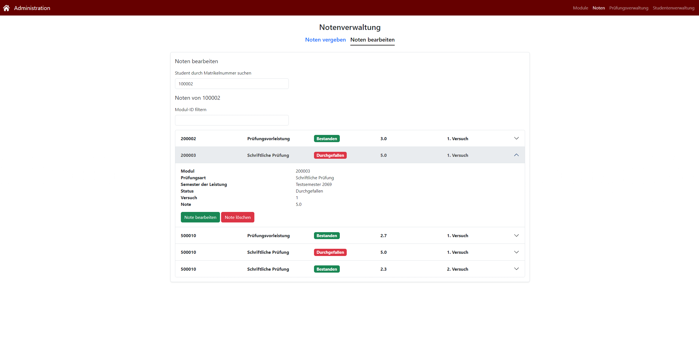

# Frontend für eine Verwaltungssoftware von Prüfungen, Studenten, Modulen und Noten

Die Verwaltungssoftware besteht aus diesem Teil und einer [API](https://github.com/DmnkWnsch/V-API).

Dieser Teil der Software wurde **nicht** von mir allein erstellt - es ist im Rahmen einer Gruppenarbeit (3 Mitglieder) entstanden. 
Mein Aufgabenbreich lag hier vorrangig im [Admin-Panel](https://github.com/DmnkWnsch/PV-Frontend/tree/main/src/routes/admin) sowie in der Einbindung der Daten unserer API in die verbleibenden Seiten.

Verwendet wurde **SvelteKit**, somit wurde hauptsächlich **JavaScript** und **HTML** eingesetzt. Zur Gestaltung haben wir **SvelteStrap** verwendet, also eine **Bootstrap-Version** mit Komponenten für Svelte. 
Zur Initialen Gestaltung von Prototypen wurde **Figma** verwendet.

## Nutzen der Software

Im Rahmen eines Software-Projekts in der Universität haben wir uns dafür entschieden, die bereitgestellte Studentenverwaltung zu überarbeiten.

Dabei ist zu beachten, dass unser Projekt nur im begrenzten Rahmen unseres Studiengangs funktioniert, da wir Einschränkungen treffen mussten um die Komplexität im Rahmen zu halten.

Dementsprechend können hier unter anderem Module erstellt oder bearbeitet werden, Studenten angelegt, Prüfungen erstellt und geplant sowie Noten vergeben und bearbeitet werden. Des weiteren wurden noch nützliche Funktionen wie das Erstellen von Teilnehmerlisten für bestimmte Prüfungen eingebunden.

## Beispiel-Seite

